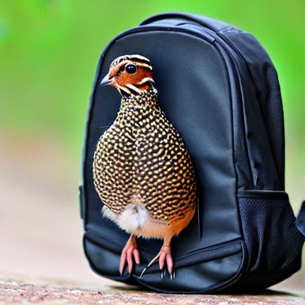

[English](README.md)

# Análisis de series temporales de codornices / Clasificador de comportamiento de codornices / Herramientas de investigación de codornices

Las codornices son aves pequeñas que se usan comúnmente en estudios de investigación debido a su comportamiento único y habilidades cognitivas. Sin embargo, rastrear y analizar el comportamiento de las codornices puede ser un desafío, especialmente cuando se utilizan métodos tradicionales como la observación manual o el seguimiento por video. En este proyecto, presentamos una solución de código abierto para la detección y clasificación del comportamiento de las codornices utilizando datos de series temporales de acelerómetros. Al aprovechar el poder del aprendizaje automático y el análisis de series temporales, nuestro enfoque permite el seguimiento automático y preciso del comportamiento de las codornices en una variedad de entornos de investigación. Con esta herramienta, los investigadores pueden experimentar fácilmente con diferentes modelos de aprendizaje automático y técnicas de ingeniería de funciones para obtener información valiosa sobre el comportamiento y las habilidades cognitivas de las codornices. Además, esta herramienta se puede utilizar para probar la eficacia de diferentes intervenciones o tratamientos sobre el comportamiento de las codornices.

## Estructura del repositorio

Este repositorio contiene las siguientes carpetas:

<pre>
├─── assets
│   ├─── images_1.png
│   ├─── *.png
│   └─── images_n.png
├─── data
│   ├─── accelerometer_data_x_y_z.csv
│   └─── labels.csv
├─── mlruns
│   ├─── .trash
│   ├─── experiment_default
│   └─── experiment_id
├─── traslations
│   ├─── READNE-sp.md
├───src
│   ├─── __init__.py
│   ├─── preprocessing.py
│   ├─── processing.py
│   ├─── utils.py
│   └─── deep_learning_module.py
├─── main.ipynb
├─── make_predictions.ipynb
├─── .gitignore
├─── poetry.lock
├─── pyproject.toml
├─── README.md
└─── requirements.txt
</pre>

## Tabla de contenido

1. Introducción: Una breve descripción del proyecto, incluyendo su propósito y objetivos.
2. Datos: Una descripción de los datos usados en este proyecto, incluyendo su fuente y formato.
3. Módulos: Una descripción de los módulos usados en este proyecto, incluyendo su propósito y funcionalidad.
4. Instalación: instrucciones detalladas sobre cómo instalar y configurar la herramienta.
5. Uso: una descripción de cómo usar la herramienta, incluidos los argumentos de la línea de comandos o las opciones de configuración.
6. Ejemplos: una colección de entradas y salidas de muestra, junto con instrucciones sobre cómo ejecutar los ejemplos.
7. Licencia: Información sobre la licencia de código abierto bajo la cual se publica el proyecto.

## 1. Introducción

Este proyecto es una herramienta de código abierto para la detección y clasificación del comportamiento de las codornices utilizando datos de acelerómetros. El objetivo de la herramienta es permitir a los investigadores rastrear y analizar el comportamiento de las codornices en una variedad de entornos de investigación. La herramienta incluye varios módulos para preprocesamiento, procesamiento, visualización y aprendizaje profundo, y puede configurarse y personalizarse fácilmente para adaptarse a las necesidades específicas de un estudio de investigación. Además, la herramienta se integra con MLFlow para proporcionar seguimiento y reproducibilidad de experimentos, e incluye una interfaz gráfica construida con Streamlit (en desarrollo) para ejecutar experimentos y explorar los resultados. En general, esta herramienta es un recurso valioso para los investigadores interesados en estudiar el comportamiento y las habilidades cognitivas de las codornices.

## 2. Data

Los datos para este proyecto se recolectaron usando acelerómetros conectados a la espalda de codornices. Los acelerómetros fueron colocados en pequeñas mochilas y llevados por las codornices mientras realizaban diversos comportamientos. Luego, los datos del acelerómetro fueron registrados y etiquetados por investigadores que vieron videos de las codornices y anotaron manualmente cada cuadro con el comportamiento correspondiente.

Los datos consisten en datos de series temporales de los acelerómetros, así como las etiquetas correspondientes para el comportamiento de las codornices. Las etiquetas de comportamiento incluyen tres clases: comportamiento normal, comportamiento reproductivo y comportamiento de acicalamiento. Los datos se recolectaron de múltiples codornices en diferentes ambientes y bajo diferentes condiciones, proporcionando una muestra diversa y representativa del comportamiento de las codornices. Los datos están disponibles en la carpeta de datos de este repositorio.

... en desarrollo ...
